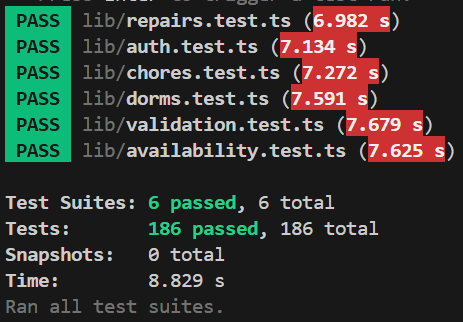

# Testing Documentation

This page outlines the testing strategies, tools, and processes used in the Dorm Chores Scheduler project to ensure reliability, code quality, and a consistent user experience.

## Automated Testing (Jest)

We use **[Jest](https://jestjs.io/)** with **ts-jest** for unit and integration testing of our business logic and utility functions.

### How to Run Tests

You can run the automated tests using the following commands from the root directory:

- **Run all tests:**
  ```bash
  npm test
  ```
- **Run tests in watch mode:**
  ```bash
  npm run test:watch
  ```

### Test Results

Below is a typical output from running the full test suite:



_Note: As of the latest build, all 186 automated tests are passing._

### Detailed Test Suites Breakdown

The automated tests are located in the `lib/` directory. Each file targets a specific domain of the application's business logic:

| Test Suite             | Detailed Description                                                                                                                                                                                                                                  |
| :--------------------- | :---------------------------------------------------------------------------------------------------------------------------------------------------------------------------------------------------------------------------------------------------- |
| `auth.test.ts`         | **Authentication & Profiles:** Validates sign-in, sign-up, and sign-out flows. It checks user role retrieval (student vs manager) and ensures profile updates (like display names) follow strict validation rules.                                    |
| `availability.test.ts` | **User Availability:** Verifies how student availability status is retrieved and updated. It tests the integration between the Supabase database and local `AsyncStorage` caching to ensure the app works reliably offline or with poor connectivity. |
| `chores.test.ts`       | **Chore Management:** Covers the entire lifecycle of a chore including creation, auto-assignment logic, status transitions (pending to completed), and deletion. It also enforces limits, such as the 500-chore cap per dorm.                         |
| `dorms.test.ts`        | **Dormitory Logic:** Validates dorm creation, membership limits, and student joining/leaving processes. It also tests complex manager features like ownership transfer and linking dorms via QR codes or manual connect codes.                        |
| `repairs.test.ts`      | **Repair Requests:** Ensures repair requests are correctly submitted with all mandatory fields (location, urgency, etc.). It tracks status transitions from pending to resolved and verifies that users can see requests they reported.               |
| `validation.test.ts`   | **Security & Data Integrity:** A critical suite that tests all input validation. It includes extensive **SQL Injection protection** tests, email format verification, and strict password policy enforcement (uppercase, symbols, etc.).              |

---

## Manual UI Testing (Expo Router)

For visual verification of components and layouts, we use a dedicated set of UI test pages built directly into the application's routing system.

### How to Access UI Tests

1. Start the development server: `npx expo start`
2. Open the app on a device or emulator.
3. Navigate to the `/ui-tests` route.
4. Select a component from the list to view its interactive test page.

### Available UI Test Pages

Located in `app/ui-tests/`, these pages allow developers to verify the look and feel of components in isolation:

- **Buttons:** `button-test.tsx`, `block-button-test.tsx`
- **Inputs:** `input-test.tsx`, `selector-test.tsx`
- **Feedback:** `inline-notification-test.tsx`, `info-panel-test.tsx`, `availability-badge-test.tsx`
- **Navigation/Layout:** `navbar-test.tsx`, `curved-banner-test.tsx`
- **Cards/Lists:** `list-item-test.tsx`, `profile-picture-test.tsx`

---

## Code Quality & Static Analysis

In addition to functional tests, we use several tools to maintain high code standards.

### Linting & Formatting

- **ESLint:** Run `npm run lint` to check for code quality issues and potential bugs.
- **Prettier:** Run `npm run format` to check if the code follows our formatting rules.
- **Fixing:** Use `npm run lint:fix` and `npm run format:fix` to automatically resolve most issues.

### Type Checking

We use **TypeScript** to ensure type safety across the codebase.

- **Run typecheck:** `npm run typecheck`

### Project Health

- **Expo Doctor:** Run `npm run doctor` to check the health of the Expo project, dependencies, and configuration.

---

## Continuous Integration (CI)

Every Pull Request and push to the `main` branch triggers a GitHub Actions workflow that runs the following checks:

1. **Dependency Audit:** `npm ci`
2. **Linting:** `npm run lint`
3. **Formatting:** `npm run format`
4. **Type Checking:** `npm run typecheck`
5. **Project Health:** `npm run doctor`

**Note:** All automated checks must pass before a Pull Request can be merged. While `npm test` is not currently part of the CI pipeline, contributors are expected to run it locally before submitting changes.
